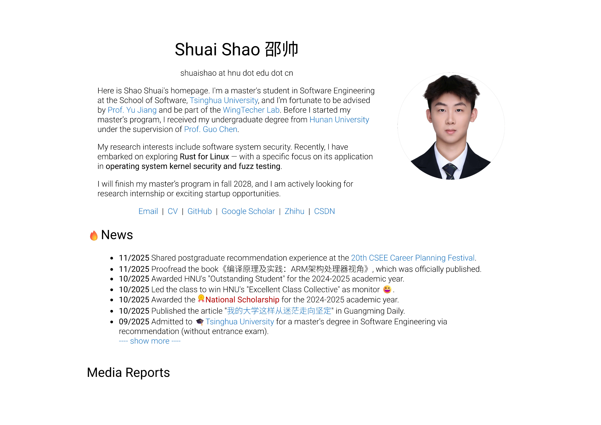
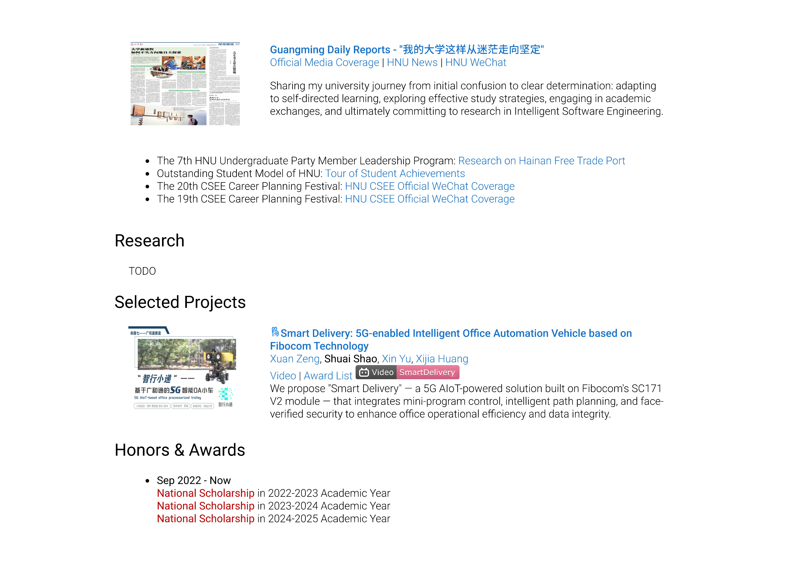
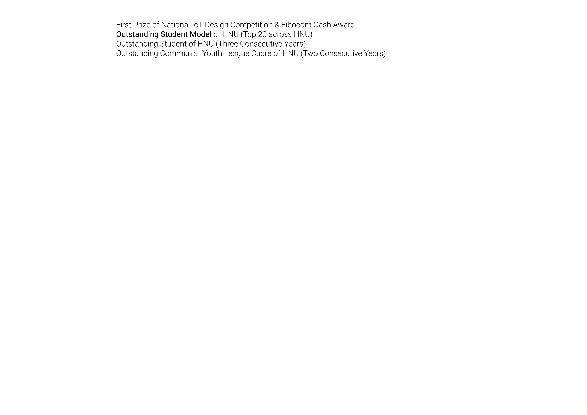

# Personal Homepage

This repository hosts the source code of my academic personal homepage.

The homepage presents my academic profile, research interests, selected news, media reports, projects, and honors.

## Preview

### Homepage Overview

## About

I am a master's student in Software Engineering at the School of Software, Tsinghua University, advised by Prof. Yu Jiang, and a member of the WingTecher Lab.  
Previously, I received my bachelor's degree from Hunan University under the supervision of Prof. Guo Chen.

My research interests lie in **software system security**, with a particular focus on **Rust for Linux**, **operating system kernel security**, and **fuzz testing**.

## Usage

This homepage is built for personal academic use.  
You are welcome to fork or adapt the structure for your own homepage with appropriate attribution.

## License

MIT License
